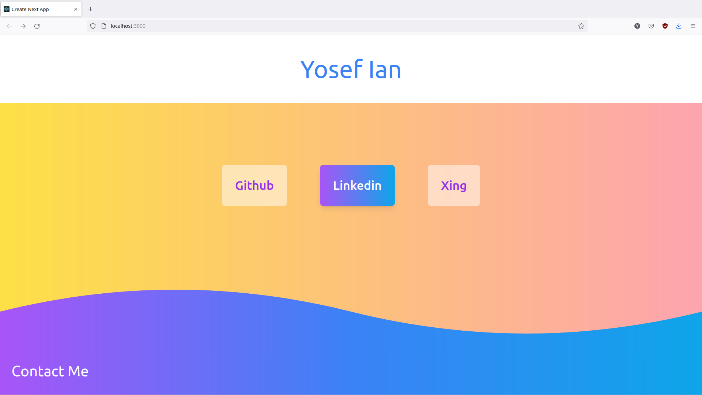
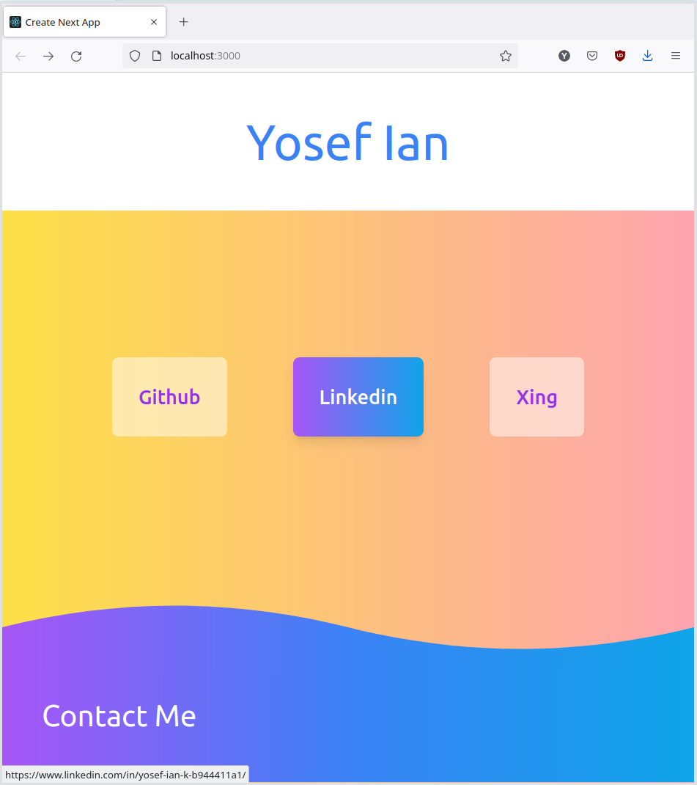

## About Me

This is my first try designing my own **responsive** personal website. Front End Stack : TailwindCSS + React (Javascript).
SVGs are created inside the jsx section of the App.js, since I do want to experiment a bit with them. 

Here are some of the screenshots: 

